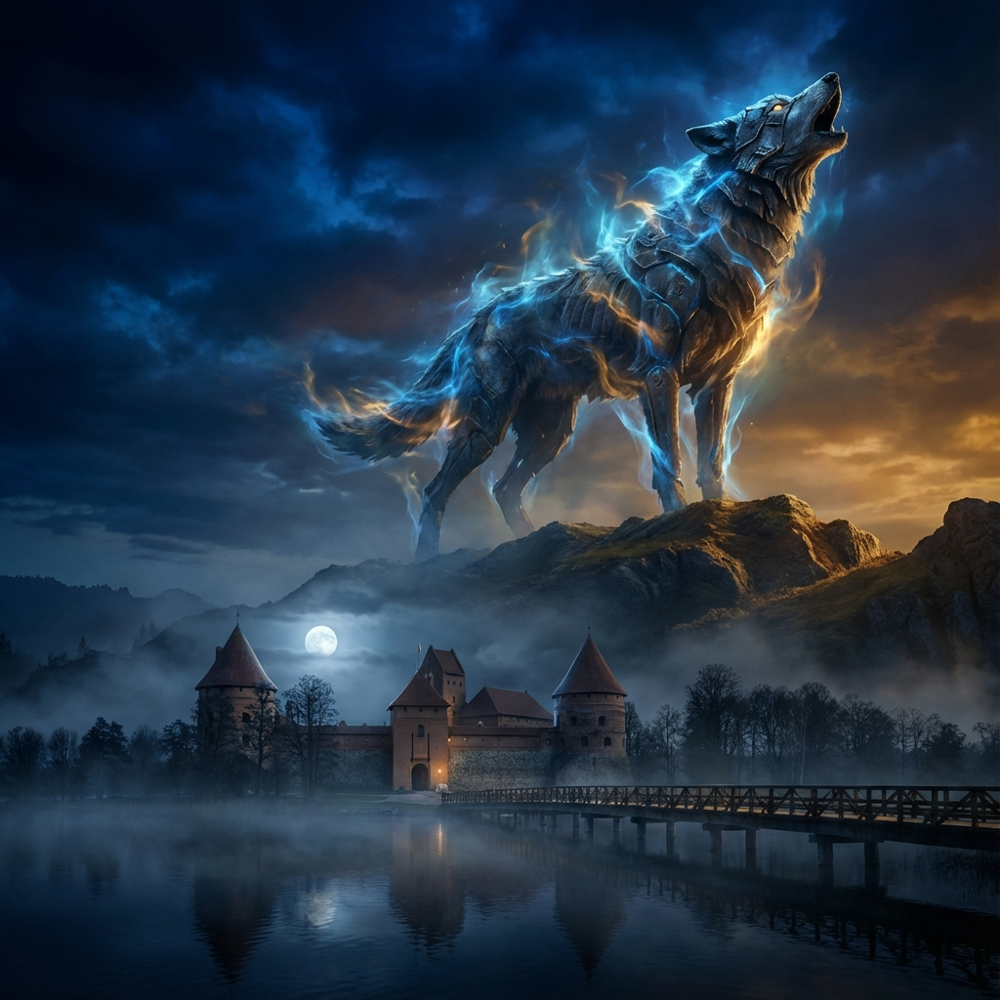
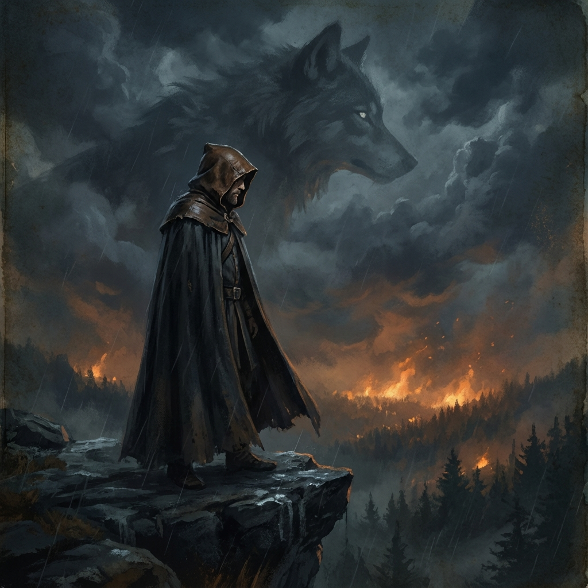

# Geležinio Vilko Saga (The Iron Wolf Saga)




"Geležinio Vilko Saga" yra epinis tamsiosios fantastikos pasakojimas apie XIV amžiaus pabaigos Lietuvą — laiką, kai brolžudiškos kovos, senieji dievai ir plieninė Ordinų tvarka susidūrė viename kruviname mazge.

## I Knyga: Vilko Tremtis (The Wolf's Exile)



Pirmas sagos tomas pasakoja apie Kunigaikščio Vytauto nuosmukį, išdavystę ir transformaciją. Po klastingos tėvo Kęstučio mirties Krėvos požemiuose, Vytautas turi tapti tuo, ko labiausiai bijojo — negailestingu politiniu žaidėju, kad susigrąžintų savo tėvų žemę.

### Skyrių apžvalga

Knyga susideda iš trijų pagrindinių dalių, kurios veda skaitytoją per Vytauto sielos skilinėjimą ir šalies likimo lūžį.

#### I dalis: Nuosmukis
Šioje dalyje stebime paskutines taikos dienas Trakuose ir klastingą spąstų parengimą Vilniuje.
*   **Senasis Šernas** & **Vilko Perspėjimas**: Kęstučio pasitikėjimas ir Vytauto nuojauta susiduria.
*   **Gintaro Sapnas**: Mistinis Birutės ryšys su jūra ir pranašiški regėjimai.
*   **Geležiniai Vartai** & **Krėvos Požemiai**: Spąstai užsidaro. Kęstutis nužudomas, o Vytautas lieka vienas prieš savo mirtinus pusbrolius.

#### II dalis: Pabėgimas
Tai išgyvenimo ir magiškojo realizmo dalis, kurioje mirtingi veiksmai susipina su gamtos dvasių pagalba.
*   **Našlė** & **Keitimas**: Birutės sielvartas ir klastingas Vytauto pabėgimas iš Krėvos persirengus moterimi.
*   **Pelkės Vaikai**: Susitikimas su Egle ir girios paslapčių apsauga.
*   **Velnio Sandėris**: Vytautas knežina savo garbę prieš Marienburgo Magistrą, pasirinkdamas mirtiną sąjungą su didžiausiais priešais.

#### III dalis: Karas ir Tvarka
Sugrįžimas namo ne kaip herojaus, o kaip keršytojo, atsivedusio svetimą ugnį.
*   **Svetimi Dievai** & **Pirmoji Kova**: Lietuva dega nuo Vytauto atvestų sąjungininkų riterių rankų.
*   **Vilniaus Apgultis** & **Pasirinkimas**: Lemtinga naktis, kai Vytautas turi nuspręsti — tapti Ordino marionete ar antrą kartą išduoti visus, kad išgelbėtų tėvų sostinę.
*   **Gintaro Auka** & **Krikštas**: Senųjų Dievų pasitraukimas, Birutės metafizinis išėjimas ir naujo, ledinio krikščioniško amžiaus pradžia.

---

### Kaip skaityti
Šis projektas yra sugeneruotas naudojant **Quarto**. Naujausią knygos versiją PDF formatu galite atsisiųsti iš [GitHub Actions](https://github.com/Algiras/wolf-saga/actions) skilties arba sugeneruoti patys lokaliai:

```bash
cd books
quarto render --to pdf
```

### Licencija
Šis kūrinys platinamas pagal **Creative Commons Attribution-NonCommercial-NoDerivs 4.0 International** (CC BY-NC-ND 4.0) licenciją.
