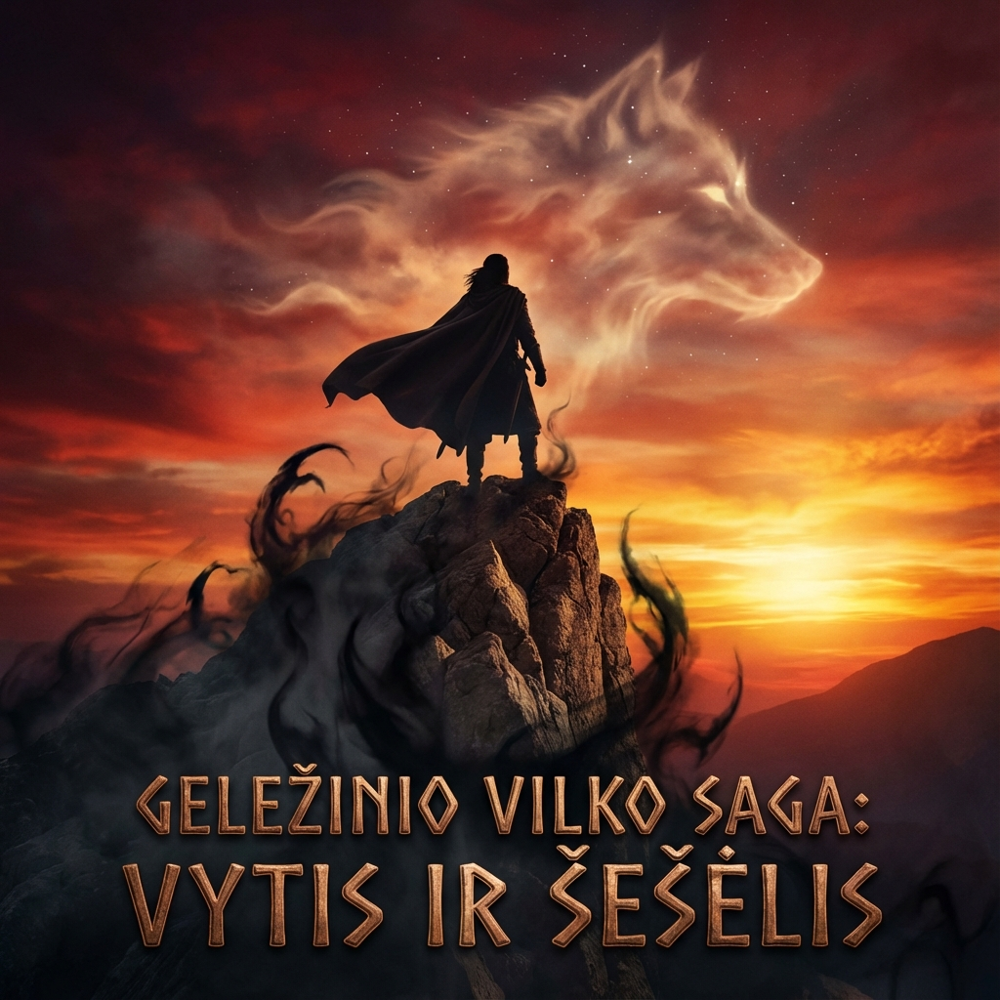

# Geležinio Vilko Saga: 2 Knygos Anonsas

Šis puslapis skirtas antrosios sagos dalies — **„Vytis ir Šešėlis“** — anonsui. 

### Trumpa apžvalga
Vytautas pasiekė vokiečių ordiną, bet kaina už jo laisvę kyla su kiekviena diena. Kol jis ruošiasi susigrąžinti Vilnių, šešėlis, kurį jis parsivežė iš Dykrų, pradeda kalbėti jo balsu. Jogaila statosi naujas pilis, bet ar jos atlaikys artėjančią vėtrą?

*Greitai...*
