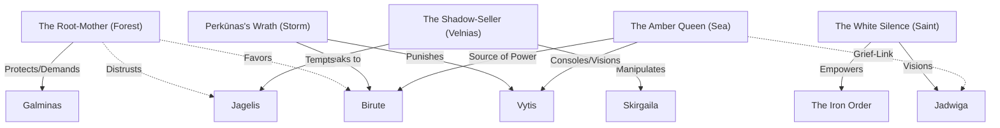

# Mystical Relationship Map

## The Web of Influence

## Key Dynamics
-   **The War of the Mothers**: The Root-Mother vs. The White Silence. A battle over the soul of the landscape itself.
-   **The Puppet Strings**: The Shadow-Seller holds the strings of Jagelis, but doesn't realize the Root-Mother is trying to trip his feet.
-   **The Reluctant Hero**: Vytis is caught between the Amber Queen (Mother's memory) and Perkūnas (Warrior's duty).
